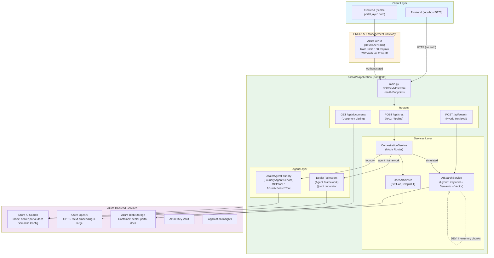
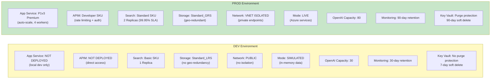
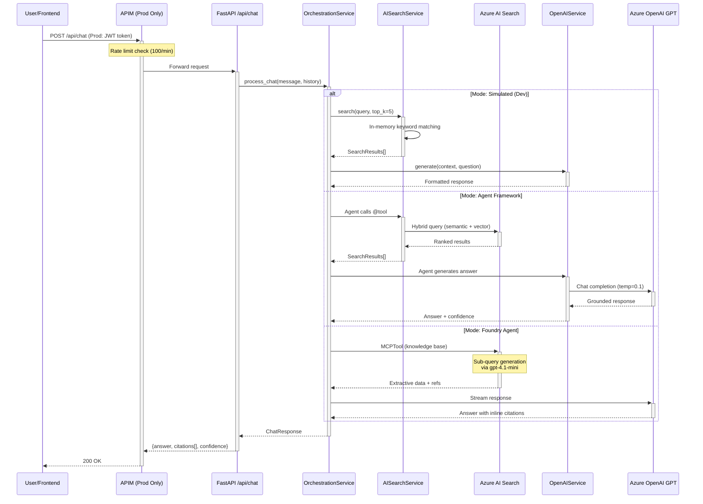

# API Layer Architecture — Dev vs Prod

## 1. High-Level Architecture



### Entry Points

- **Dev** → Frontend at `localhost:5173` hits the FastAPI app directly over HTTP (no auth, no gateway)
- **Prod** → Frontend at `dealer-portal.jayco.com` routes through **Azure API Management** which enforces JWT authentication (Entra ID) and rate limiting (100 req/min)

### FastAPI Application (`src/api/app/main.py`)

- Runs on port 8000 via Gunicorn with 4 Uvicorn workers
- Three main endpoints:
  - `POST /api/chat` — RAG pipeline (retrieval + generation)
  - `POST /api/search` — Direct hybrid search
  - `GET /api/documents` — Document listing/download

### Services Layer

- **OrchestrationService** — Routes requests to one of three modes based on the `AGENT_SERVICE` env var
- **AISearchService** — Performs hybrid retrieval (keyword + semantic + vector)
- **OpenAIService** — Generates grounded answers using GPT with `temperature=0.1`

### Agent Layer (Two Implementations)

- **Agent Framework** (`dealer_agent.py`) — Uses `@tool` decorator; agent autonomously decides when to search
- **Foundry Agent** (`dealer_agent_foundry.py`) — Uses MCPTool with a knowledge base or falls back to AzureAISearchTool

---

## 2. Dev vs Prod Infrastructure Comparison



| Dimension | Dev | Prod |
|-----------|-----|------|
| **Compute** | Local only (App Service not deployed) | P1v3 Premium with auto-scale |
| **API Gateway** | None — direct access | APIM with rate limiting + JWT auth |
| **Search** | Basic SKU, 1 replica | Standard SKU, 2 replicas (HA) |
| **Data Mode** | `SIMULATED=true` — in-memory chunks | `SIMULATED=false` — live Azure AI Search |
| **Network** | Public, no isolation | VNet-integrated, private endpoints only |
| **Storage** | LRS (local redundancy) | GRS (geo-redundant) |
| **OpenAI Capacity** | 30 TPM | 80 TPM |
| **Secrets** | No purge protection, 7-day soft delete | Purge protection enabled, 90-day retention |
| **CORS** | `localhost:5173`, `localhost:3000` | `https://dealer-portal.jayco.com` |

**Key insight:** In dev, `SIMULATED_MODE=true` means the AISearchService uses 11 preloaded in-memory document chunks with keyword scoring — no Azure services needed. In prod, everything is live with managed identity auth.

---

## 3. Request Flow — Chat Endpoint (RAG Pipeline)



### Mode Descriptions

1. **Simulated (Dev default):** Query → in-memory keyword search → format response from top chunk. Fast, zero-cost, offline-capable.

2. **Agent Framework:** The `DealerTechAgent` receives the query and autonomously calls its `search_technical_documents` tool against live Azure AI Search. The agent generates a grounded answer via GPT-4o.

3. **Foundry Agent (Prod default):** Creates a temporary agent in Azure AI Foundry, uses the MCPTool to query a knowledge base (which generates sub-queries via `gpt-4.1-mini`), streams the response with inline citations, then cleans up the agent.

---

## 4. API Endpoints Detail

### `POST /api/chat`

| Field | Type | Description |
|-------|------|-------------|
| `message` | string (max 2000) | User's question |
| `conversation_id` | string (optional) | For multi-turn context |
| `history` | array (optional) | Previous messages |

**Response:** `{ answer, citations[], conversation_id, confidence_score }`

### `POST /api/search`

| Field | Type | Description |
|-------|------|-------------|
| `query` | string | Search query |
| `top_k` | int (1-20, default 5) | Number of results |
| `source_filter` | string (optional) | Filter by source system |

**Response:** `{ results[], total_count }`

### `GET /api/documents`

| Param | Type | Description |
|-------|------|-------------|
| `source` | string | `"all"`, `"sharepoint"`, or `"revver"` |

**Response:** `{ documents[], total_count }`

### Health & Config Endpoints

- `GET /` — Service info (mode, version, status)
- `GET /health` — Health check
- `GET /api/config` — Max citations config

---

## 5. Deployment Configuration

### Dev (`azure.yaml`)

```yaml
name: mydealer-portal
infra:
  provider: bicep
  path: ./infra
  module: main
# No services section — manual local management
```

### Prod (`azure.yaml.prod`)

```yaml
name: mydealer-portal
infra:
  provider: bicep
  path: ./infra
  module: main
services:
  api:
    project: ./src/api
    language: python
    host: appservice
```

### Docker (`src/api/Dockerfile`)

```dockerfile
FROM python:3.11-slim
WORKDIR /app
COPY requirements.txt .
RUN pip install --no-cache-dir -r requirements.txt
COPY . .
EXPOSE 8000
CMD ["gunicorn", "-w", "4", "-k", "uvicorn.workers.UvicornWorker",
     "--bind", "0.0.0.0:8000", "app.main:app"]
```

---

## 6. Security Differences

| Layer | Dev | Prod |
|-------|-----|------|
| **Authentication** | None (Azure CLI credential) | Entra ID JWT at APIM |
| **Network** | Public access enabled | VNet + Private Endpoints |
| **TLS** | HTTP (localhost) | HTTPS enforced (TLS 1.2+) |
| **Rate Limiting** | None | APIM: 100 req/min |
| **Identity** | User principal | System-assigned Managed Identity |
| **Key Vault** | Relaxed (7-day soft delete) | Strict (purge protection + 90-day) |

---

## 7. Key Files Reference

| File | Purpose |
|------|---------|
| `src/api/app/main.py` | App entry, routes, CORS, health checks |
| `src/api/app/config.py` | Environment variable loading |
| `src/api/app/models/schemas.py` | Request/response Pydantic models |
| `src/api/app/routers/chat.py` | Chat endpoint (RAG pipeline) |
| `src/api/app/routers/search.py` | Search endpoint (hybrid retrieval) |
| `src/api/app/routers/documents.py` | Document listing/download |
| `src/api/app/services/orchestrator.py` | Mode routing (simulated/agent/foundry) |
| `src/api/app/services/ai_search.py` | Hybrid search (sim + live) |
| `src/api/app/services/openai_service.py` | LLM answer generation |
| `src/api/app/agents/dealer_agent.py` | Agent Framework implementation |
| `src/api/app/agents/dealer_agent_foundry.py` | Foundry Agent implementation |
| `src/api/app/agents/prompts.py` | Shared system prompt |
| `src/config/search_config.json` | Index schema, vectorization, agentic retrieval |
| `infra/parameters/dev.bicepparam` | Dev environment config |
| `infra/parameters/prod.bicepparam` | Prod environment config |
| `infra/modules/appservice.bicep` | App Service infrastructure |
| `infra/modules/apim.bicep` | API Management (prod gateway) |
