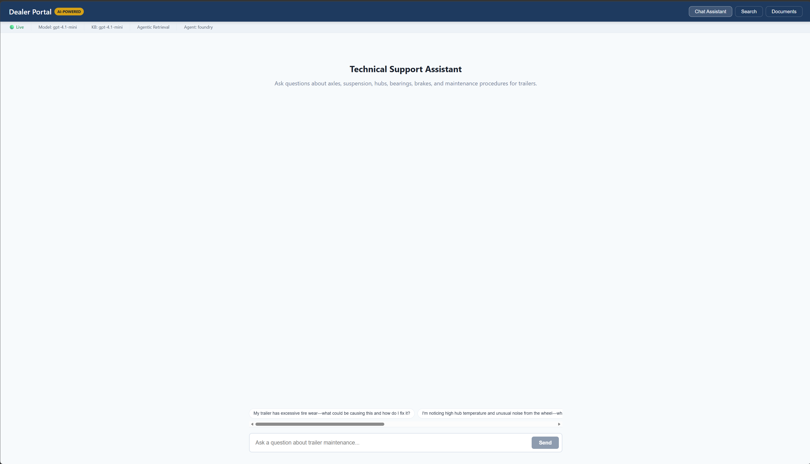

# Development Guide — Running the Dealer Portal Locally

> **Scope:** This guide covers local development only. Production deployment uses Azure App Service, API Management (APIM), Entra ID authentication, and Key Vault for secrets. See [Infrastructure Deployment](#production-differences) below for details.

---

## Prerequisites

| Tool | Version | Purpose |
|------|---------|---------|
| Python | 3.11+ | FastAPI backend + indexer |
| Node.js | 20+ | React frontend (Vite dev server) |
| npm | 10+ | Frontend dependency management |
| Azure CLI | 2.60+ | Authentication (`az login`) |

You also need an active Azure subscription with the following deployed resources:
- Azure AI Foundry project (with AI Services endpoint)
- Azure OpenAI deployment (`gpt-4.1-mini` or `gpt-4.1-mini`)
- Azure AI Search service (with indexed documents)
- Azure Blob Storage (document source)

---

## 1. Environment Setup

### Clone and Install

```bash
cd dealer-portal-exp

# Create Python virtual environment and install all deps
python3 -m venv .venv
source .venv/bin/activate
pip install -r src/api/requirements.txt
pip install -r src/indexer/requirements.txt

# Install frontend dependencies
cd src/frontend
npm install
cd ../..
```

### Configure Environment Variables

Copy `.env` to the repo root (it is gitignored). The key settings for local dev with Azure:

```bash
# Required: Set to false to use real Azure services
SIMULATED_MODE=false

# Agent mode: "foundry" uses Foundry Agent Service + MCPTool (agentic retrieval)
AGENT_SERVICE=foundry

# Enable agentic retrieval (knowledge base + MCP endpoint)
AGENTIC_RETRIEVAL_ENABLED=true

# Azure AI Foundry project endpoint
AZURE_AI_PROJECT_ENDPOINT=https://<your-ai-services>.services.ai.azure.com/api/projects/<your-project>

# Azure OpenAI
AZURE_OPENAI_DEPLOYMENT=gpt-4.1-mini
AZURE_OPENAI_EMBEDDING_DEPLOYMENT=text-embedding-3-large

# Azure AI Search
AZURE_SEARCH_ENDPOINT=https://<your-search>.search.windows.net
AZURE_SEARCH_INDEX_NAME=dealer-portal-docs
AZURE_SEARCH_API_KEY=<your-search-admin-key>

# Persist agents across test runs (avoids re-creation cost)
PERSIST_FOUNDRY_AGENTS=true
```

### Authenticate with Azure

The app uses `DefaultAzureCredential`, which picks up your Azure CLI session:

```bash
az login
az account set --subscription <your-subscription-id>
```

Your user principal needs these RBAC roles on the AI Services resource:
- **Cognitive Services OpenAI User** — for model inference
- **Search Index Data Reader** — for querying the search index
- **Search Service Contributor** — for managing the agentic retrieval knowledge base

---

## 2. Index Documents (First Time Only)

Before the chat works, documents must be indexed in Azure AI Search:

```bash
source .venv/bin/activate
cd src

# Index PDFs into Azure AI Search (creates index, chunks, embeds, uploads)
python -m indexer.index_documents

# Provision the agentic retrieval pipeline (knowledge source + knowledge base + MCP connection)
python -m indexer.index_documents --provision-agentic
```

This creates:
- Search index `dealer-portal-docs` with vector + semantic configuration
- Knowledge source `dealer-knowledge-source` pointing to the index
- Knowledge base `dealer-knowledge-base` (gpt-4.1-mini model, extractiveData output, medium reasoning)
- MCP project connection `dealer-knowledge-mcp-connection` for the Foundry Agent to access the KB

---

## 3. Start the Application

The quickest way to launch both services:

```bash
./start.sh
```

This will:
- Kill any existing processes on ports 8000 and 5173
- Load environment variables from `.env`
- Start the FastAPI backend (port 8000) with `--reload`
- Start the Vite frontend (port 5173)
- Write logs to `logs/backend.log` and `logs/frontend.log`
- Print the current mode, agent service, and agentic retrieval status

To stop everything:

```bash
./stop.sh
```

### Manual Start (Alternative)

If you prefer separate terminals for better log visibility:

**Terminal 1 — Backend:**
```bash
cd src/api
source ../../.venv/bin/activate
uvicorn app.main:app --reload --host 0.0.0.0 --port 8000
```

**Terminal 2 — Frontend:**
```bash
cd src/frontend
npm run dev
```

### Verify

The services are available at:

| URL | Description |
|-----|-------------|
| http://localhost:5173 | Frontend (React app) |
| http://localhost:8000 | Backend health check / mode info |
| http://localhost:8000/docs | Swagger UI (interactive API docs) |
| http://localhost:8000/redoc | ReDoc API documentation |

Confirm live mode:

```bash
curl http://localhost:8000/
# Expected: {"service":"COMPANY Dealer Portal API","version":"1.0.0","status":"healthy","mode":"live"}
```

The Vite dev server proxies all `/api/*` requests to the FastAPI backend at `localhost:8000` (configured in `vite.config.ts`), so the frontend and backend work together seamlessly without CORS issues.

---

## 5. Using the Application

### Chat Interface

The main chat panel sends questions to `POST /api/chat`. With `AGENT_SERVICE=foundry` and `AGENTIC_RETRIEVAL_ENABLED=true`, each question:

1. Creates a Foundry Agent with an MCPTool connected to the knowledge base
2. The agent uses agentic retrieval — the KB model (gpt-4.1-mini) autonomously generates sub-queries, searches the index multiple times, and reasons over results
3. The agent model (gpt-4.1-mini) generates a grounded answer with inline citations

**Typical latency:** 10–30 seconds per query (KB retrieval + response generation)



### Document Search

The search panel sends queries to `POST /api/search` for direct Azure AI Search queries (hybrid + semantic reranking).

### Document List

`GET /api/documents` returns the indexed document inventory.

---

## 6. API Reference (Quick)

### POST /api/chat

```bash
curl -X POST http://localhost:8000/api/chat \
  -H "Content-Type: application/json" \
  -d '{"message": "How do I repack bearings on my COMPANY trailer?"}'
```

**Request body:**
```json
{
  "message": "Your technical question here",
  "conversation_id": "optional-uuid-for-multi-turn",
  "history": []
}
```

**Response:**
```json
{
  "answer": "Direct Answer:\nTo repack standard tapered roller wheel bearings...",
  "citations": [
    {
      "document_name": "Hub, Drums, & Bearings Installation Instructions.pdf",
      "page_number": null,
      "chunk_text": "...",
      "relevance_score": 0.0,
      "source_system": "Foundry Agent"
    }
  ],
  "conversation_id": "uuid",
  "confidence_score": 0.8
}
```

### POST /api/search

```bash
curl -X POST http://localhost:8000/api/search \
  -H "Content-Type: application/json" \
  -d '{"query": "torque specifications", "top_k": 5}'
```

### GET /api/documents

```bash
curl http://localhost:8000/api/documents?source=all
```

---

## 7. Running Tests

### Integration Test (Agentic Retrieval)

The live integration test exercises the full Foundry Agent + MCPTool pipeline:

```bash
source .venv/bin/activate
PERSIST_FOUNDRY_AGENTS=true python -m tests.test_agentic_retrieval_live
```

This runs 5 queries, logs activity traces (sub-queries, latency), and writes results to `logs/`.

### Unit Tests

```bash
python -m pytest tests/ -v
```

---

## 8. Architecture: How It Flows (Dev)

```
Browser (localhost:5173)
    │
    │  Vite proxy: /api/* → localhost:8000
    ▼
FastAPI (localhost:8000)
    │
    │  AGENT_SERVICE=foundry, SIMULATED_MODE=false
    ▼
OrchestrationService
    │
    │  _process_with_foundry_agent()
    ▼
DealerAgentFoundry (dealer_agent_foundry.py)
    │
    │  AGENTIC_RETRIEVAL_ENABLED=true → MCPTool
    ▼
Azure AI Foundry Agent Service
    │
    │  Agent creates conversation, calls MCPTool
    ▼
Azure AI Search — Agentic Retrieval (Knowledge Base)
    │
    │  gpt-4.1-mini plans sub-queries → searches index → reasons
    ▼
Agent model (gpt-4.1-mini) generates grounded answer with citations
```

---

## 9. Configuration Reference

| Variable | Description | Dev Value |
|----------|-------------|-----------|
| `SIMULATED_MODE` | `true` = mock data, `false` = real Azure | `false` |
| `AGENT_SERVICE` | `foundry` or `agent_framework` | `foundry` |
| `AGENTIC_RETRIEVAL_ENABLED` | Use KB + MCPTool (vs plain AzureAISearchTool) | `true` |
| `AZURE_AI_PROJECT_ENDPOINT` | Foundry project endpoint | (your endpoint) |
| `AZURE_OPENAI_DEPLOYMENT` | Agent model deployment | `gpt-4.1-mini` |
| `AZURE_OPENAI_KB_MODEL_DEPLOYMENT` | Knowledge Base model for query planning | `gpt-4.1-mini` |
| `AZURE_SEARCH_ENDPOINT` | AI Search service URL | (your endpoint) |
| `AZURE_SEARCH_INDEX_NAME` | Search index name | `dealer-portal-docs` |
| `AZURE_SEARCH_API_KEY` | Admin key (dev only — prod uses MI) | (your key) |
| `MAX_CITATIONS` | Max citations returned per response | `5` |
| `MAX_OUTPUT_TOKENS` | Max output tokens for agent response | `4096` |
| `PERSIST_FOUNDRY_AGENTS` | Keep agents after use (saves creation time) | `true` |
| `CORS_ORIGINS` | Allowed origins for CORS | `http://localhost:5173` |

---

## 10. Production Differences

Production deployment adds several Azure services and security layers that are **not used in local dev**:

| Concern | Dev (Local) | Production |
|---------|-------------|------------|
| **Entry point** | Direct `localhost:8000` | Azure API Management (APIM) gateway |
| **Authentication** | None (Azure CLI credential) | Entra ID JWT validation at APIM |
| **Secrets** | `.env` file with plaintext keys | Azure Key Vault (Managed Identity) |
| **Hosting** | `uvicorn --reload` | Azure App Service (Linux, Gunicorn) |
| **Frontend** | Vite dev server (`localhost:5173`) | Azure Static Web Apps or CDN |
| **Search auth** | API key in `.env` | Managed Identity (no keys) |
| **Networking** | Public internet | VNet integration + Private Endpoints |
| **Monitoring** | Console logs | Application Insights + Log Analytics |
| **Rate limiting** | None | APIM policies (per-subscription quotas) |
| **TLS** | HTTP (localhost) | HTTPS enforced (App Service managed cert) |

### Deploying to Production

```bash
# Deploy infrastructure
az deployment group create \
  --resource-group rg-dealer-prod \
  --template-file infra/main.bicep \
  --parameters infra/parameters/prod.bicepparam

# Deploy API code to App Service
az webapp up \
  --name app-dealer-prod \
  --resource-group rg-dealer-prod \
  --runtime "PYTHON:3.11" \
  --src-path src/api

# Build and deploy frontend
cd src/frontend
npm run build
# Upload dist/ to Static Web Apps or Blob Storage $web container
```

See `infra/README.md` for full Bicep module details and `azure.yaml.prod` for the production deployment descriptor.

---

## Troubleshooting

| Issue | Cause | Fix |
|-------|-------|-----|
| `"mode": "simulated"` in health check | `SIMULATED_MODE=true` | Set to `false` in `.env` and restart |
| 403 on agent tool calls | Missing RBAC on AI Services managed identity | Assign Search Index Data Reader + Search Service Contributor |
| `MCPTool` connection fails | MCP connection uses wrong auth type | Re-run `python -m indexer.index_documents --provision-agentic` |
| Slow responses (>90s) | gpt-4.1-mini response generation is the bottleneck | Expected behavior; KB retrieval itself is 4–12s |
| `FOUNDRY_AGENT_AVAILABLE = False` | Missing `azure-ai-projects` package | `pip install -r src/api/requirements.txt` |
| Frontend shows network error | Backend not running or wrong port | Ensure `uvicorn` is on port 8000; Vite proxies to it |
