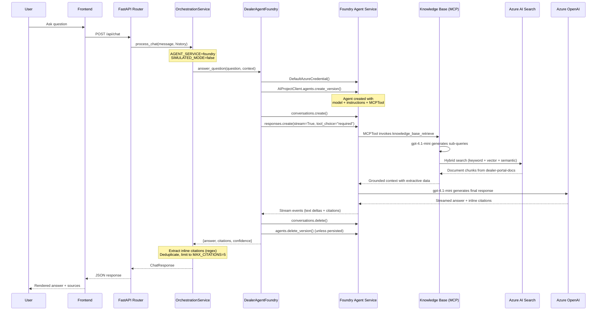

# Foundry Agent Service Execution Path

Detailed execution flow when `AGENT_SERVICE=foundry` and `SIMULATED_MODE=false`.

---

## Prerequisites

Before the Foundry agent path can execute, documents must be indexed:

```bash
# 1. Upload PDFs to blob storage (per source)
python scripts/upload_to_blob.py --dir ./data/sharepoint_docs --container sharepoint-docs
python scripts/upload_to_blob.py --dir ./data/revver_docs --container revver-docs

# 2. Index documents into AI Search
python -m indexer.index_documents --dir ./data/sharepoint_docs --source SharePoint
python -m indexer.index_documents --dir ./data/revver_docs --source Revver
```

---

## Runtime Execution Flow

### 1. API Request Received

**File:** `src/api/app/routers/chat.py`

```
POST /api/chat
Body: { "message": "What is the torque spec for 7K axles?", "conversation_id": "...", "history": [...] }
```

The FastAPI router validates the request against `ChatRequest` schema and calls
the orchestration service.

---

### 2. Routing Decision

**File:** `src/api/app/services/orchestrator.py`
**Method:** `OrchestrationService.process_chat()`

```python
if not self.simulated_mode and self.agent_service == "foundry":
    return await self._process_with_foundry_agent(message, conversation_id, history)
```

Checks:
- `SIMULATED_MODE` must be `false`
- `AGENT_SERVICE` must be `"foundry"`

---

### 3. Foundry Agent Initialization (Lazy)

**File:** `src/api/app/services/orchestrator.py`
**Method:** `_get_foundry_agent()`

Creates `DealerAgentFoundry` instance (once, reused for subsequent requests) with:
- `project_endpoint` ← `AZURE_AI_PROJECT_ENDPOINT`
- `model_deployment_name` ← `AZURE_OPENAI_DEPLOYMENT`
- `search_index_name` ← `AZURE_SEARCH_INDEX_NAME`
- `search_connection_id` ← `AI_SEARCH_PROJECT_CONNECTION_ID`

---

### 4. Agent Question Processing

**File:** `src/api/app/agents/dealer_agent_foundry.py`
**Method:** `DealerAgentFoundry.answer_question(question, context)`

#### 4a. Authentication

```python
credential = DefaultAzureCredential()
```

Uses Azure Identity chain (Managed Identity → Azure CLI fallback).

#### 4b. Client Connection

```python
async with AIProjectClient(endpoint=self.project_endpoint, credential=credential) as project_client,
           project_client.get_openai_client() as openai_client:
```

Opens connection to Azure AI Foundry project and gets OpenAI-compatible client.

#### 4c. Build Tools

```python
tools = self._get_tools()
```

Tool selection based on `AGENTIC_RETRIEVAL_ENABLED`:

**MCPTool (default, agentic retrieval):**
```python
MCPTool(
    server_label="knowledge-base",
    server_url=f"{search_endpoint}/knowledgebases/dealer-knowledge-base/mcp?api-version=2025-11-01-Preview",
    require_approval="never",
    allowed_tools=["knowledge_base_retrieve"],
    project_connection_id="dealer-knowledge-mcp-connection",
)
```

The MCPTool connects to the Azure AI Search Knowledge Base, which has its own model
(`gpt-4.1-mini`, `extractiveData` output mode) that generates sub-queries and reasons over results.

**AzureAISearchTool (fallback):**
```python
AzureAISearchTool(indexes=[AISearchIndexResource(
    project_connection_id=...,
    index_name="dealer-portal-docs",
    query_type=AzureAISearchQueryType.SEMANTIC,
)])
```

#### 4d. Create Agent

```python
agent = await project_client.agents.create_version(
    agent_name="DealerTechAgentFoundry",
    definition=PromptAgentDefinition(
        model=self.model_deployment_name,
        instructions=self.instructions,    # ← DEALER_SYSTEM_PROMPT from prompts.py
        tools=[search_tool],
    ),
)
```

Creates a versioned prompt agent in Foundry Agent Service with:
- Model (e.g., `gpt-4.1-mini`)
- System instructions (shared prompt from `prompts.py`)
- Tools (AzureAISearchTool attached)

#### 4e. Create Conversation

```python
conversation = await openai_client.conversations.create()
```

Creates a conversation thread to hold the exchange.

#### 4f. Stream Response

```python
stream = await openai_client.responses.create(
    conversation=conversation.id,
    extra_body={"agent_reference": {"name": agent.name, "type": "agent_reference"}},
    input=prompt,
    stream=True,
    tool_choice="required",    # ← Forces agent to search before answering
)
```

The agent:
1. Receives the user question + context
2. **Must** invoke the AzureAISearchTool (`tool_choice="required"`)
3. AI Search returns relevant document chunks from `dealer-portal-docs` index
4. Agent generates a grounded response using the retrieved context
5. Response streams back with text + citation annotations

#### 4g. Parse Response & Citations

```python
async for event in stream:
    if event.type == "response.output_text.delta":
        response_text += event.delta
    elif event.type == "response.output_item.done":
        # Extract url_citation / file_citation annotations
```

Citations are extracted from response annotations (URLs, filenames, text snippets).

#### 4h. Cleanup

```python
# Delete conversation
await openai_client.conversations.delete(conversation_id=conversation.id)

# Delete agent (unless PERSIST_FOUNDRY_AGENTS=true)
if not persist_agents:
    await project_client.agents.delete_version(agent_name=agent.name, agent_version=agent.version)
```

---

### 5. Response Mapping

**File:** `src/api/app/services/orchestrator.py`
**Method:** `_process_with_foundry_agent()`

Maps Foundry agent output to the standard `ChatResponse` schema:

```python
citations = [
    Citation(
        document_name=c.get("title", ""),
        page_number=None,
        chunk_text=c.get("text", "")[:300],
        relevance_score=0.0,
        source_system="Foundry Agent",
    )
    for c in result.get("citations", [])
]

return ChatResponse(
    answer=result.get("answer", ""),
    citations=citations,
    conversation_id=conversation_id,
    confidence_score=result.get("confidence", 0.0),
)
```

---

### 6. API Response

**File:** `src/api/app/routers/chat.py`

Returns JSON to frontend:
```json
{
    "answer": "The torque specification for 7K axles is...",
    "citations": [
        {"document_name": "Jayco Axle Torque Procedures.pdf", "chunk_text": "...", ...}
    ],
    "conversation_id": "abc-123",
    "confidence_score": 0.8
}
```

---

## Files Involved (in execution order)

| Order | File | Role |
|-------|------|------|
| 1 | `src/api/app/routers/chat.py` | HTTP endpoint, request validation |
| 2 | `src/api/app/models/schemas.py` | Request/response schema definitions |
| 3 | `src/api/app/services/orchestrator.py` | Routes to Foundry agent path |
| 4 | `src/api/app/agents/dealer_agent_foundry.py` | Full agent lifecycle (create → run → cleanup) |
| 5 | `src/api/app/agents/prompts.py` | System instructions (DEALER_SYSTEM_PROMPT) |

---

## Required Environment Variables

```bash
# Core routing
AGENT_SERVICE=foundry
SIMULATED_MODE=false

# Azure AI Foundry
AZURE_AI_PROJECT_ENDPOINT=https://<ai-services>.services.ai.azure.com/api/projects/<project>

# Model
AZURE_OPENAI_DEPLOYMENT=gpt-4.1-mini

# Knowledge Base model (for agentic retrieval sub-queries)
AZURE_OPENAI_KB_MODEL_DEPLOYMENT=gpt-4.1-mini

# Agentic retrieval (MCPTool)
AGENTIC_RETRIEVAL_ENABLED=true
AZURE_SEARCH_ENDPOINT=https://<search>.search.windows.net

# Search connection (configured in Foundry portal)
AI_SEARCH_PROJECT_CONNECTION_ID=<connection-id>
AZURE_SEARCH_INDEX_NAME=dealer-portal-docs

# Response tuning
MAX_OUTPUT_TOKENS=4096
MAX_CITATIONS=5

# Agent lifecycle
PERSIST_FOUNDRY_AGENTS=true   # true = reuse agent across requests
```

---

## Sequence Diagram



---

## Cost & Performance Notes

- **Agent creation/deletion per request** adds ~200-500ms overhead. Set `PERSIST_FOUNDRY_AGENTS=true` for demos to avoid this.
- **tool_choice="required"** ensures the agent always searches — no hallucinated answers without grounding.
- **Conversation cleanup** prevents orphaned threads from consuming quota.
- The Foundry path has **no pre-retrieval step** — the model autonomously decides search queries based on the user's question.
