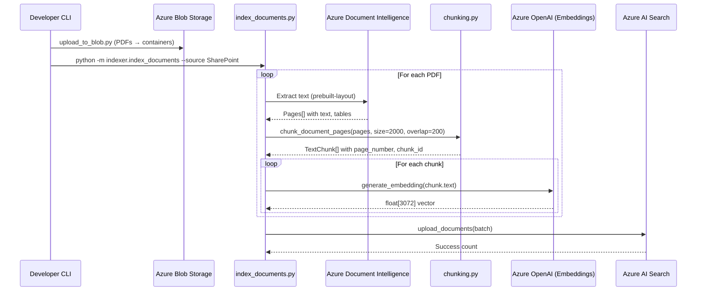
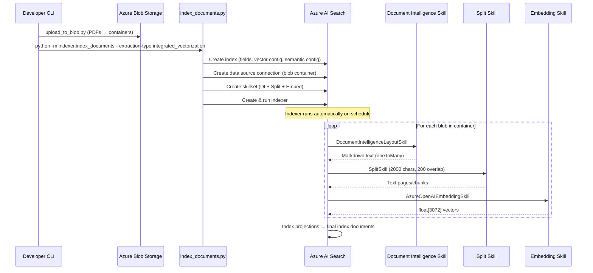
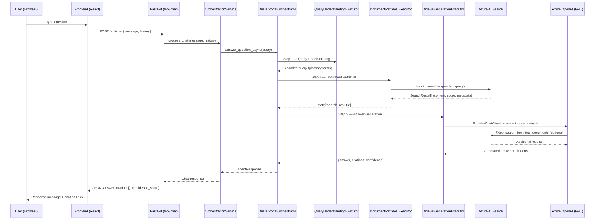
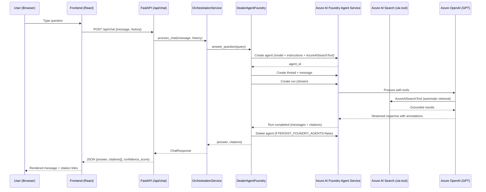
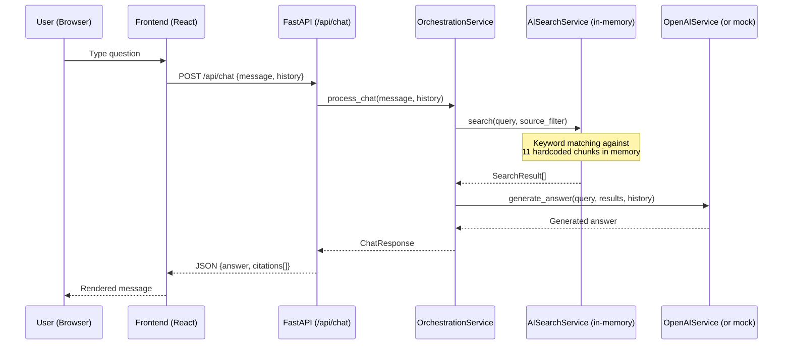

# Indexing Pipeline & Data Flow

This document describes the two extraction/indexing modes, the agent architecture,
and the full data flow from document ingestion through search to the UI.

---

## Dev Workflow (Default)

The default development workflow uses **Document Intelligence mode**:

```
1. Upload PDFs to Azure Blob Storage
   $ python scripts/upload_to_blob.py --dir ./data/sharepoint_docs --container sharepoint-docs
   $ python scripts/upload_to_blob.py --dir ./data/revver_docs --container revver-docs

2. Index documents (extraction + chunking + embedding → AI Search)
   $ python -m indexer.index_documents --dir ./data/sharepoint_docs --source SharePoint
   $ python -m indexer.index_documents --dir ./data/revver_docs --source Revver

3. Run the API + Frontend
   $ uvicorn app.main:app --reload    (from src/api/)
   $ npm run dev                       (from src/frontend/)
```

### Environment Variables That Control the Pipeline

| Variable | Default | Purpose |
|----------|---------|---------|
| `EXTRACTION_TYPE` | `document_intelligence` | Selects indexing pipeline |
| `CHUNK_SIZE` | `2000` | Characters per chunk |
| `CHUNK_OVERLAP` | `200` | Overlap between chunks |
| `CHUNK_CROSS_PAGE` | `false` | Chunk across page boundaries |
| `SEARCH_USE_COMPRESSION` | `true` | Enable scalar quantization (int8) |
| `USE_AZURE_DOCUMENT_INTELLIGENCE` | `true` | Use Azure DI (false = PyPDF2 fallback) |
| `AGENT_SERVICE` | `agent_framework` | Agent routing (`agent_framework` or `foundry`) |
| `SIMULATED_MODE` | `true` | Use in-memory search (no Azure resources needed) |

---

## Extraction Mode 1: Document Intelligence (Default)

**Set:** `EXTRACTION_TYPE=document_intelligence`

Manual pipeline where the indexer controls each step: extraction, chunking,
embedding generation, and upload to AI Search.

### Sequence Diagram



### Pipeline Details

1. **Extraction**: Azure Document Intelligence `prebuilt-layout` model extracts
   per-page text with table structure. Falls back to PyPDF2 if
   `USE_AZURE_DOCUMENT_INTELLIGENCE=false`.

2. **Chunking**: Fixed-size character chunking (2000 chars, 200 overlap).
   - `CHUNK_CROSS_PAGE=false` (default): Each page chunked independently; short pages stay separate.
   - `CHUNK_CROSS_PAGE=true`: All pages concatenated before chunking; chunks can span page boundaries.

3. **Embedding**: Azure OpenAI `text-embedding-3-large` (3072 dimensions).

4. **Index Upload**: Documents uploaded in batch with fields: `content`, `content_vector`,
   `content_with_source`, `document_name`, `source_system`, `page_number`, `chunk_parent_id`.

---

## Extraction Mode 2: Integrated Vectorization

**Set:** `EXTRACTION_TYPE=integrated_vectorization`

Serverless pipeline where Azure AI Search manages the full extraction-to-index
flow via indexer + skillset. The developer only uploads PDFs to blob.

### Sequence Diagram



### Pipeline Details

1. **Data Source**: Blob container connection (`sharepoint-docs` or `revver-docs`).
2. **Skillset** (3 skills in sequence):
   - `DocumentIntelligenceLayoutSkill` — extracts markdown with h3 header depth
   - `SplitSkill` — text_split_mode=pages, 2000 char max, 200 overlap
   - `AzureOpenAIEmbeddingSkill` — text-embedding-3-large, 3072 dimensions
3. **Index Projections**: Maps skillset outputs to index fields, preserving `source_system`
   from the parent document.
4. **Automatic refresh**: Indexer can run on schedule to pick up new/modified blobs.

### When to Use Each Mode

| Consideration | Document Intelligence | Integrated Vectorization |
|---------------|----------------------|--------------------------|
| Control over chunking | Full (custom logic, cross-page) | Limited (SplitSkill params only) |
| Operational overhead | Must run indexer manually | Runs on schedule |
| Debugging | Step-by-step visibility | Check indexer status in portal |
| Custom metadata | Set per-document at index time | Mapped from blob metadata |
| Cost | DI + OpenAI calls from your code | Same services, managed by Search |
| Best for | Dev/testing, custom logic | Production steady-state |

---

## Vector Compression

The index uses **scalar quantization (int8)** to reduce vector storage by ~4x
while maintaining quality through rescoring.

Configuration (`search_config.json`):
```json
"compression": {
    "name": "dealer-scalar-quantization",
    "kind": "scalarQuantization",
    "parameters": { "quantized_data_type": "int8" },
    "rescoring_options": {
        "enable_rescoring": true,
        "default_oversampling": 4
    }
}
```

- **Rescoring**: After approximate search with compressed vectors, re-ranks using
  original full-precision vectors for accuracy.
- **Oversampling 4x**: Retrieves 4× candidates before rescoring to maintain recall.
- **Toggle**: Set `SEARCH_USE_COMPRESSION=false` to disable (uses full float32 vectors).

---

## Agent Architecture

### Agent Framework Mode (`AGENT_SERVICE=agent_framework`)



### Foundry Agent Mode (`AGENT_SERVICE=foundry`)



### Simulated Mode (`SIMULATED_MODE=true`)

For local development without Azure resources:



---

## Search Configuration

The search index is defined in `src/config/search_config.json` and consumed by
`AzureAISearchClient`. Key schema:

| Field | Type | Purpose |
|-------|------|---------|
| `id` | String (key) | Stable chunk ID (md5 hash) |
| `content` | String (searchable) | Chunk text |
| `content_vector` | Collection(Single) | 3072-dim embedding |
| `content_with_source` | String | `[filename] chunk_text` for display |
| `document_name` | String (filterable) | Source PDF filename |
| `source_system` | String (filterable) | "SharePoint", "Revver", "DynamicWeb" |
| `page_number` | Int32 (filterable) | Source page number |
| `chunk_parent_id` | String (filterable) | Groups chunks by parent doc |
| `blob_url` | String | Direct link to source blob |

### Search Behavior

- **Hybrid search**: Keyword (BM25) + vector (HNSW cosine) combined
- **Semantic reranking**: Cross-encoder reranks top results
- **Source filtering**: OData filter `source_system eq 'SharePoint'`
- **Top-K**: 5 results by default (`search_config.top_k`)

---

## Blob Container Layout (Production)

```
Storage Account
├── portal-docs/           ← Legacy combined container (kept for migration)
├── sharepoint-docs/       ← SharePoint-sourced documents
│   └── documents/         ← blob_prefix from upload script
│       ├── Lippert Master Manual.pdf
│       └── ...
├── revver-docs/           ← Revver-sourced documents
│   └── documents/
│       ├── IS-System-Troubleshooting-Guide.pdf
│       └── ...
└── document-chunks/       ← Extracted chunk JSON (debug/audit)
```

Each container maps to a separate **indexer** in integrated vectorization mode,
all feeding into the single `dealer-portal-docs` index with appropriate
`source_system` labels.
